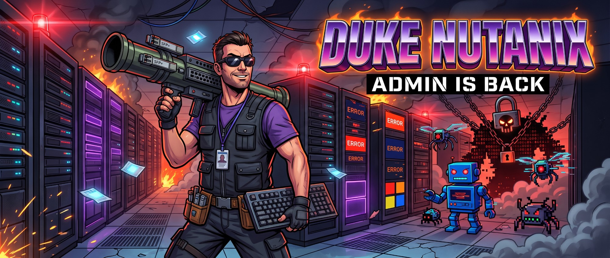

<p align="center">
  
</p>

# DUKE NUTANIX: The admin is back

A retro first-person shooter that runs in the browser, in the spirit of Duke Nukem 3D, where every level is a datacenter.
A ransomware has seized the server rooms and its corrupted processes have taken physical form between the racks.
The on-call admin, with his shades and his oversized ego, sets out to reboot everything: 5 episodes, 50 levels.

No external assets: textures, logos, sprites, weapons and sounds are all generated in code
(2D canvas + Web Audio API, with the admin's voice provided by the browser's speech synthesis). No build step, no dependencies.

The look is deliberately pixelated:
- **Textures** are 128x128, so logos, cabling and labels stay readable.
- **Props** such as pallets of servers, UPS batteries and water coolers are small 3D boxes, pre-rendered from 16 angles like Doom's rotating sprites. They show their real faces as you walk around them.
- **Enemies and items** get a dark outline so they stand out from the racks.
- **Weapons in hand** are small 3D models (boxes and tubes) rendered in perspective with per-face lighting,
  then pixelated and outlined. They are drawn at twice the resolution of the 3D view, dim in dark areas and light up when firing.
- **Lighting** is colored and baked per level into a lightmap: pools of light under the ceiling panels (with shadows),
  green glow from the exit signs, red and blue from badge doors, LED spill from the racks, and ambient occlusion along the walls.
  Each episode has its own mood and distance fog (icy blue in the cooling zone, sodium lamps in the archives...).
- **Dynamic lights**: muzzle flashes, projectiles, explosions and armed UPS batteries light up walls, floors and enemies.
- **Bloom** around LEDs, screens, neon panels and plasma, plus a soft vignette.

All of this runs in the software renderer at 480x230 and costs a few milliseconds per frame. Press **G** to switch to
the LOW graphics mode (baked lighting only, no dynamic lights, bloom or vignette); the game also drops to LOW by itself
on a machine that can't keep up.

## Play

Open `index.html` in a browser, or serve the folder:

```sh
python3 -m http.server 8000
# then open http://localhost:8000
```

Progress is saved in the browser (CONTINUE button, and a level select for unlocked levels).

## Controls

| Key | Action |
| --- | --- |
| WASD / ZQSD / ↑↓ | Move (QWERTY and AZERTY) |
| Mouse / ← → | Turn |
| Click / Ctrl | Fire |
| E / Space | Open doors, search walls (secret areas), drink from water coolers, activate the REBOOT terminal |
| 1-8 / wheel | Switch weapon |
| Shift | Run |
| Tab / M | Datacenter map |
| Esc / P | Pause (mouse sensitivity, graphics) |
| N / V | Mute sound / the admin's voice |
| G | Graphics quality (high / low) |

Cheat codes: `iddqd` (root mode) and `idkfa`.

## Nutanix migrations

Every level contains 5 special racks, each in its vendor's colors:

| Rack | Count | Colors |
| --- | --- | --- |
| Broadcom ESXi | 2 | Broadcom red, round badge |
| Proxmox | 1 | orange and black, the "X" |
| Vates XCP-ng | 1 | navy and blue |
| Hyper-V | 1 | the four Microsoft squares |

Hit one with the **keyboard** (weapon 1) and it migrates into a **Nutanix** rack (charcoal and Iris purple).
Migrating all 5 racks in a level grants an armor bonus. The counter is shown in the top-right corner
and in the end-of-level summary.

## Arsenal

| # | Weapon | Ammo |
| --- | --- | --- |
| 1 | Mechanical keyboard (also the migration tool) | none |
| 2 | Cage nut pistol | M6 cage nuts |
| 3 | Packet shotgun | jumbo frames |
| 4 | Gatling riveter (cage nuts) | M6 cage nuts |
| 5 | SFP bazooka | SFP+ modules |
| 6 | Hard drives (bouncing grenades) | hard drives |
| 7 | ZIP compressor: shrinks enemies so you can stomp them | energy cells |
| 8 | Overclock cannon | energy cells |

## Bestiary

- **Enemies**: bugs, viral drones, BSOD bots, forum trolls and spammers.
- **Mini-bosses** guard the exit of every x5 level. The exit stays locked until they go down.

  | Level | Mini-boss | Tactic |
  | --- | --- | --- |
  | E1M5 | Cable Spaghetti Monster | throws RJ45 plugs |
  | E2M5 | Hot Spot | fireball fans |
  | E3M5 | Packet Storm | rapid packet bursts |
  | E4M5 | Bit Rot | slow and tough, summons bugs |
  | E5M5 | Shadow IT | fast, teleports around you |

- **Bosses**, one per episode: BOTNET, CRYPTOMINER, ROOTKIT, ZERO-DAY, and the RANSOMWARE in the finale.

Also featured:
- explosive UPS batteries;
- secret areas behind fake walls;
- water coolers and energy drinks (turbo);
- the admin's one-liners, shown as subtitles and spoken by speech synthesis.

## Levels

- E1M1, E1M2 and the E5M10 finale are hand-drawn in `js/levels.js`.
- The other 47 are generated procedurally by `js/levelgen.js`, but each one from a fixed seed:
  a given level is identical in every playthrough and on every machine, as if it had been drawn once and for all.
  - BSP split into rooms linked by doors.
  - Badge doors on the critical path.
  - A secret room in a dead end.
  - Per-room decoration: rack rows with hot and cold aisles, CRAC units, pillars, storage.
  - Rising difficulty, a mini-boss on the 5th level and a boss arena on the 10th level of each episode.

Check all 50 levels:

```sh
node tools/validate-levels.js
```

For every level, the script checks:
- dimensions and borders;
- that every door is framed by walls;
- that every cell, the exit and the special racks are reachable with the available badges;
- that the exit cannot be triggered from another room;
- that every x5 level has exactly one mini-boss.

## Project layout

```
index.html               page, menus, styles
docs/banner.jpg          README banner
js/levelgen.js           procedural generator + map validation
js/levels.js             episodes, level names, hand-drawn levels, difficulty settings
js/textures.js           textures, rack logos, sprites
js/weapons.js            first-person weapon models and their pre-rendering
js/lighting.js           lightmap baking, dynamic lights, bloom
js/audio.js              synthesized sound effects
js/game.js               raycasting engine, AI, weapons, HUD, save game, game loop
tools/validate-levels.js checks all 50 levels
```
